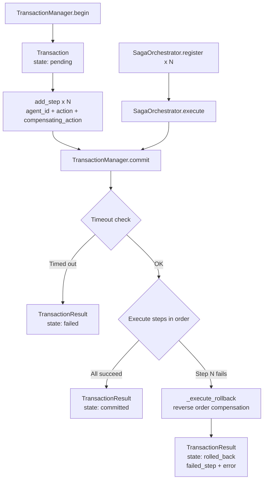

# aumai-transactions

**ACID-like transactions for multi-agent operations.**

Coordinate actions across multiple agents with commit/rollback semantics. When a step fails, every completed step is automatically compensated in reverse order.

[](https://pypi.org/project/aumai-transactions/)
[](https://www.python.org/)
[](LICENSE)
[](https://github.com/aumai)

---

## What is this?

Imagine you are booking a business trip. The process involves three steps: reserve the flight, book the hotel, and submit a corporate card charge. If the card charge fails, you don't want a stranded flight reservation and a ghost hotel booking — you want everything unwound cleanly so you can start over.

`aumai-transactions` brings that same guarantee to multi-agent AI systems. When an agent workflow involves multiple agents each performing an action (calling an API, updating a record, sending a message), this library ensures that either *all actions succeed together* or *all previously completed actions are undone in reverse order*. No partial state is left behind.

It implements the **Saga pattern** — a well-established distributed systems technique — adapted for the multi-agent context. Each step in a transaction carries a forward action (what to do) and an optional compensating action (how to undo it). If any step fails, the library automatically executes compensating actions for everything that already completed.

---

## Why does this matter?

AI agents operating in multi-step workflows face a category of failure that traditional software handles with database transactions: partial execution. An agent workflow that:

1. Creates a customer record in a CRM
2. Sends a welcome email
3. Initializes a billing subscription

...could fail at step 3. Without rollback logic, you now have a phantom customer and an unreachable welcome email with no corresponding subscription. Cleaning this up manually is error-prone and often impossible at scale.

`aumai-transactions` solves this by making rollback explicit and automatic:
- Each step declares its compensating action upfront (delete the customer record, send a cancellation email).
- If any step fails, the library runs compensating actions for all completed steps in reverse order.
- The result is a clean, auditable `TransactionResult` that describes exactly what happened and what was compensated.

This is the same pattern that Stripe uses for payment workflows, that flight booking systems use for reservation sequences, and that supply chain systems use for multi-party order fulfillment.

---

## Architecture



---

## Features

| Feature | Description |
|---|---|
| **Begin / add_step / commit** | Simple 3-call API for building and executing transactions. |
| **Automatic rollback** | On any step failure, all completed steps are compensated in reverse order. |
| **Saga orchestrator** | Higher-level `SagaOrchestrator` for choreography-based multi-agent sagas. |
| **Action handlers** | Plug in callables for each action name; or run without handlers for dry-run / test scenarios. |
| **Timeout detection** | Transactions past their `timeout_seconds` are marked `failed` before execution begins. |
| **Rich result object** | `TransactionResult` captures final state, completed step IDs, failed step ID, and error message. |
| **Persistent CLI state** | CLI stores transaction state to `~/.aumai/transactions/transactions.json`. |
| **Pydantic models** | All state objects are Pydantic models — serializable, validatable, and type-safe. |
| **Minimal dependencies** | Requires only `pydantic` and `click`. |

---

## Quick Start

### Install

```bash
pip install aumai-transactions
```

### Python API — three-step commit

```python
from aumai_transactions import TransactionManager

# Define action handlers: what actually executes when a step runs
def create_user(action: str, data: dict) -> None:
    print(f"Creating user {data['user_id']} ...")

def delete_user(action: str, data: dict) -> None:
    print(f"Rolling back: deleting user {data['user_id']} ...")

def send_welcome_email(action: str, data: dict) -> None:
    print(f"Sending welcome email to {data['email']} ...")

def cancel_welcome_email(action: str, data: dict) -> None:
    print(f"Rolling back: cancelling welcome email for {data['email']} ...")

manager = TransactionManager(action_handlers={
    "create_user": create_user,
    "delete_user": delete_user,
    "send_welcome_email": send_welcome_email,
    "cancel_welcome_email": cancel_welcome_email,
})

tx = manager.begin(timeout_seconds=30)

manager.add_step(
    tx,
    agent_id="user_agent",
    action="create_user",
    data={"user_id": "u123", "name": "Alice"},
    compensating_action="delete_user",
)

manager.add_step(
    tx,
    agent_id="email_agent",
    action="send_welcome_email",
    data={"email": "alice@example.com"},
    compensating_action="cancel_welcome_email",
)

result = manager.commit(tx)
print(f"Outcome: {result.state.value}")
# "committed" if all steps succeeded
# "rolled_back" if any step failed
```

### CLI — create and inspect a transaction

```bash
# Create a new pending transaction
aumai-transactions create --timeout 120
```

```json
{
  "transaction_id": "a1b2c3d4-...",
  "state": "pending",
  "created_at": "2026-02-27T12:00:00+00:00",
  "timeout_seconds": 120
}
```

```bash
# Check its status
aumai-transactions status --tx-id a1b2c3d4-...
```

---

## CLI Reference

All commands are under the `aumai-transactions` entry point.

### `aumai-transactions create`

Create a new pending transaction and print its metadata.

| Option | Required | Default | Description |
|---|---|---|---|
| `--timeout SECONDS` | No | `60` | Transaction timeout in seconds |

**Example:**

```bash
aumai-transactions create --timeout 300
```

State stored to: `~/.aumai/transactions/transactions.json`

---

### `aumai-transactions status`

Display the current persisted state of a transaction by ID.

| Option | Required | Description |
|---|---|---|
| `--tx-id UUID` | Yes | The transaction ID to query |

**Example:**

```bash
aumai-transactions status --tx-id a1b2c3d4-e5f6-7890-abcd-ef1234567890
```

Output:

```json
{
  "transaction_id": "a1b2c3d4-...",
  "state": "pending",
  "steps": 0,
  "created_at": "2026-02-27T12:00:00+00:00",
  "timeout_seconds": 60
}
```

---

## Python API

### Using `SagaOrchestrator` (high-level)

`SagaOrchestrator` is the ergonomic entry point when you don't need fine-grained control over the transaction lifecycle:

```python
from aumai_transactions import SagaOrchestrator, TransactionManager

manager = TransactionManager(action_handlers={
    "reserve_flight": reserve_flight_handler,
    "cancel_flight": cancel_flight_handler,
    "book_hotel": book_hotel_handler,
    "cancel_hotel": cancel_hotel_handler,
    "charge_card": charge_card_handler,
    "refund_card": refund_card_handler,
})

saga = SagaOrchestrator(manager)

saga.register("flight_agent", "reserve_flight", {"flight_id": "F123"}, "cancel_flight")
saga.register("hotel_agent", "book_hotel", {"hotel_id": "H456"}, "cancel_hotel")
saga.register("billing_agent", "charge_card", {"amount": 850.00}, "refund_card")

result = saga.execute(timeout_seconds=60)

if result.state.value == "committed":
    print("Trip booked successfully!")
elif result.state.value == "rolled_back":
    print(f"Booking failed at step {result.failed_step}: {result.error}")
    print(f"Compensated steps: {result.completed_steps}")
```

### Manual rollback

Call `rollback()` explicitly on a pending or active transaction to trigger compensating actions for all steps:

```python
tx = manager.begin()
manager.add_step(tx, "agent_a", "step_a", {}, compensating_action="undo_a")
manager.add_step(tx, "agent_b", "step_b", {}, compensating_action="undo_b")

# Decide to abort before committing
result = manager.rollback(tx)
# result.state.value == "rolled_back"
```

### Retrieving transactions

```python
# By ID
tx = manager.get_transaction(transaction_id)

# All transactions
all_txs = manager.get_all_transactions()
for t in all_txs:
    print(f"{t.transaction_id}: {t.state.value} ({len(t.steps)} steps)")
```

---

## Configuration

`TransactionManager` accepts an optional `action_handlers` dict mapping action name strings to callables:

```python
ActionHandler = Callable[[str, dict[str, object]], None]

manager = TransactionManager(action_handlers={
    "my_action": my_handler_function,
    "my_undo_action": my_undo_handler_function,
})
```

When `action_handlers` is omitted (or an action name has no registered handler), steps are recorded and sequenced but no side effect is executed. This is useful for:
- **Testing:** verify transaction structure without executing side effects.
- **Dry runs:** simulate a workflow and inspect the `TransactionResult`.

---

## Transaction lifecycle

```
pending → active → committed
                 ↘ rolled_back
       → failed (timeout)
```

| State | Meaning |
|---|---|
| `pending` | Transaction created; steps can still be added. |
| `active` | `commit()` has been called; execution in progress. |
| `committed` | All steps completed successfully. |
| `rolled_back` | A step failed; compensating actions were executed. |
| `failed` | Transaction exceeded its timeout before execution began. |

---

## How it works — technical deep-dive

### Step execution

`TransactionManager.commit()` iterates `tx.steps` in order. For each step, it looks up `step.action` in `_handlers` and calls the handler if found. Step IDs of successfully executed steps are collected in `completed_steps`.

If any step handler raises an exception, `_execute_rollback()` is immediately called with the list of completed step IDs. It iterates those steps in *reverse order*, looks up each `step.compensating_action` in `_handlers`, and calls the handler. Compensation errors are silently swallowed (best-effort semantics) to avoid masking the original failure.

### Timeout check

The timeout is evaluated once at the start of `commit()`, not per-step. The deadline is `tx.created_at + timedelta(seconds=tx.timeout_seconds)`. If the current UTC time exceeds the deadline when `commit()` is called, the transaction transitions directly to `failed` without executing any steps.

### State mutation

`Transaction` is a Pydantic v2 model, which is mutable by default. `_set_state()` assigns to `tx.state` in place and updates the registry so that `get_transaction()` always reflects the current state. All callers hold a reference to the same object, so state is consistent without returning updated copies.

### In-memory vs. persistent state

`TransactionManager` is in-memory. The CLI layer handles persistence: `_load_manager()` reads `~/.aumai/transactions/transactions.json` on startup; `_save_manager()` writes it after every command.

---

## Integration with other AumAI projects

| Project | How they work together |
|---|---|
| `aumai-toolsanitizer` | Sanitize tool call payloads before they are recorded as transaction step data. |
| `aumai-toolwatch` | Wrap fingerprint capture operations in a transaction for atomic multi-tool baseline updates. |
| `aumai-agentbus` | Use transactions as the coordination primitive for multi-agent message bus choreography. |

---

## Contributing

See [CONTRIBUTING.md](CONTRIBUTING.md). Bug reports, feature requests, and pull requests are welcome.

```bash
git clone https://github.com/aumai/aumai-transactions
cd aumai-transactions
pip install -e ".[dev]"
pytest
```

---

## License

Apache 2.0 — see [LICENSE](LICENSE).
